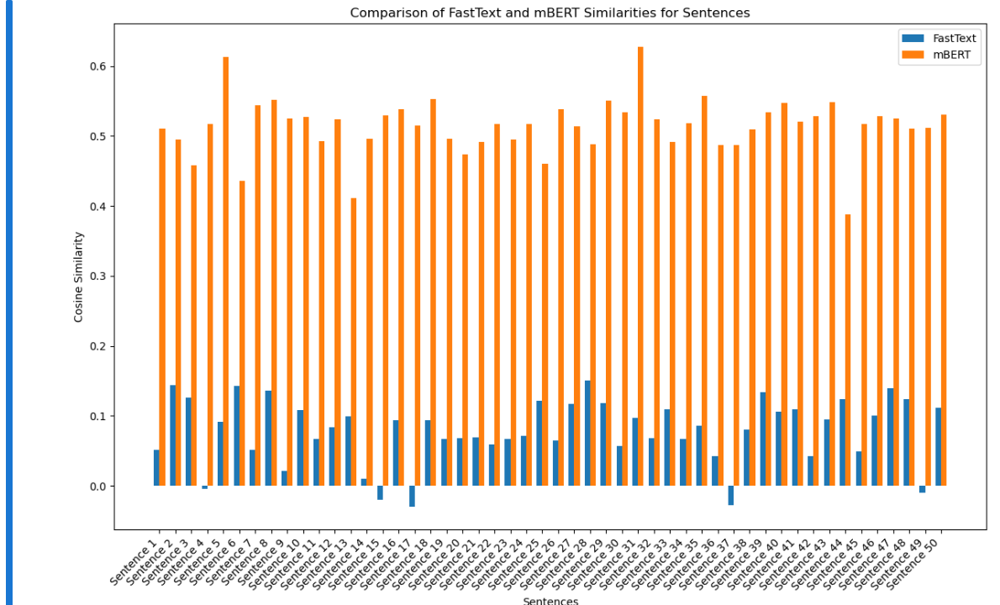
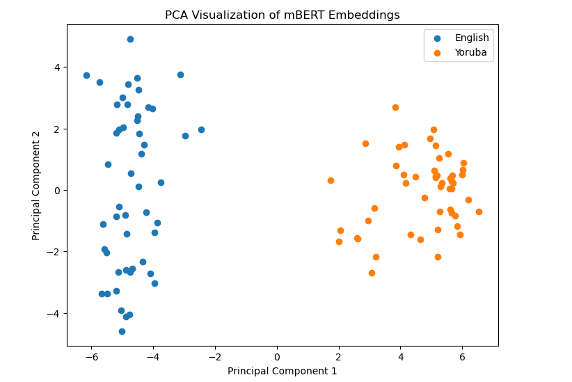

<table>
  <caption>
    Course Project Info
  </caption>
<tbody>
  <tr>
    <th>Code Repository URL</th>
    <td>https://github.com/uazhlt-ms-program/ling-582-fall-2024-course-project-code-onigiri-sandwich</td>
  </tr>
  <tr>
    <th>Demo URL (optional)</th>
    <td>N/A</td>
  </tr>
  <tr>
    <th>Team name</th>
    <td>Onigiri Sandwich</td>
  </tr>
</tbody>
</table>


## Project description

This project explores cross-lingual word embedding matching between Yoruba, a low-resource language, and English. Using FastText and mBERT embeddings, it evaluates cosine similarity to benchmark their effectiveness. 

Yoruba is a tonal language, where the meaning of words changes based on pitch. This makes embedding-based methods like FastText (which rely on static embeddings) less effective since they do not account for tone. Contextual models like mBERT may better capture tonal variations by analyzing the sentence context.

**Key Features:** 

- Use of FastText as a static embedding baseline. 
- Comparison with mBERT, a state-of-the-art multilingual transformer. 
- Focus on Yoruba's unique linguistic properties as a tonal language.

## Projected Timeline

<table>
  <thead>
    <tr>
      <th>Date</th>
      <th>Milestone</th>
    </tr>
  </thead>
  <tbody>
    <tr>
      <td><strong>Nov 15</strong></td>
      <td><strong>Complete dataset exploration</strong>: Reviewed pre-trained embeddings (FastText and mBERT) and set up data structures for Yoruba-English sentence pairs.</td>
    </tr>
    <tr>
      <td><strong>Nov 20</strong></td>
      <td><strong>Develop word-matching script</strong>: Implemented initial script to match Yoruba words to English using FastText embeddings.</td>
    </tr>
    <tr>
      <td><strong>Nov 24</strong></td>
      <td><strong>Expand sentence matching</strong>: Adapted the script to compare full Yoruba and English sentences using FastText and mBERT embeddings.</td>
    </tr>
    <tr>
      <td><strong>Dec 1</strong></td>
      <td><strong>Initial evaluation</strong>: Ran cosine similarity evaluations for FastText and mBERT on a subset of Yoruba-English sentence pairs.</td>
    </tr>
    <tr>
      <td><strong>Dec 4</strong></td>
      <td><strong>Visualization and error analysis</strong>: Generated bar graphs comparing FastText and mBERT results and conducted PCA visualization of embeddings.</td>
    </tr>
    <tr>
      <td><strong>Dec 5</strong></td>
      <td><strong>Statistical analysis and robustness check</strong>: Performed t-tests and evaluated model performance on multiple random subsets of data.</td>
    </tr>
    <tr>
      <td><strong>Dec 7</strong></td>
      <td><strong>Finalize documentation</strong>: Documented steps in the Jupyter Notebook, created reproducibility instructions, and saved all outputs (CSV and visualizations).</td>
    </tr>
    <tr>
      <td><strong>Dec 8</strong></td>
      <td><strong>Submit project</strong>: Submitted the Jupyter Notebook, requirements file, and final report with supplemental materials.</td>
    </tr>
  </tbody>
</table>


## Summary of individual contributions
<table>
  <thead>
  <tr>
    <th>Team member</th>
    <th>Role/contributions</th>
  </tr>
  </thead>
<tbody>
  <tr>
    <th><b>Shawna Birnbaum</b></th>
    <td>Sole team member: Conducted all tasks including data preprocessing, embedding evaluation, and error analysis.</td>
  </tr>
  <tr>
    <th><b>N/A</b></th>
    <td>N/A</td>
  </tr>
  <tr>
    <th><b>N/A</b></th>
    <td>N/A</td>
  </tr>
</tbody>
</table>


## Results

### Comparison of FastText and mBERT 

The cosine similarity scores for Yoruba-English sentence pairs using FastText and mBERT embeddings: 



- **FastText:** Scores indicate poor sentence-level alignment. 
- **mBERT:** Scores demonstrate better contextual understanding. 

### Statistical Analysis 

A **t-test** was conducted to determine the disparities between FastText and mBERT scores: 
- **T-Statistic:** `-50.16` 
- **P-Value:** `1.09e-71` 

**Conclusion:** mBERT significantly outperforms FastText.

## Error analysis

### PCA Visualization of mBERT Embeddings 

Below is a PCA plot showing how mBERT embeddings separate Yoruba and English sentences: 

 

**Key Insights:**

- Yoruba and English embeddings form distinct clusters, reflecting mBERT’s effectiveness in contextual understanding. 
- Minimal overlap highlights strong differentiation in embedding space.
- Many repetitive or incorrect matches in FastText and mBERT may stem from the inability to fully encode tonal nuances of Yoruba. For example, words with identical spellings but different tones could have been incorrectly treated as synonyms by the embedding models.

## Reproducibility

### Steps to Reproduce: 
1. Clone the repository: 
```bash
git clone https://github.com/uazhlt-ms-program/ling-582-fall-2024-course-project-code-onigiri-sandwich 
cd ling-582-fall-2024-course-project-code-onigiri-sandwich
```
2. Install dependencies:
```bash
pip install -r requirements.txt
```
3. Open the Jupyter Notebook:
```bash
jupyter notebook yoruba_project.ipynb
```

OR

CLI:
```bash
python yoruba_project.py
```

4. Run the notebook cells sequentially:

-   The notebook is structured into sections for **data preprocessing**, **evaluation**, **statistical analysis**, and **visualization**.
   
5.  View the outputs:
    
-   Similarity results will be saved as `.csv` files.
-   Visualizations, including bar graphs and PCA plots, will be displayed in the notebook.

## Future improvements

### Limitations:

-   Small dataset size may not fully capture linguistic diversity.
-   Static FastText embeddings struggle with sentence-level meaning.

### Proposed Improvements:

-   Fine-tune mBERT on Yoruba-English sentence pairs for better alignment.
-   Explore more advanced multilingual models like XLM-R.
-   Use full dataset with additional Yoruba-English translations.
- Acquire more computational resources.